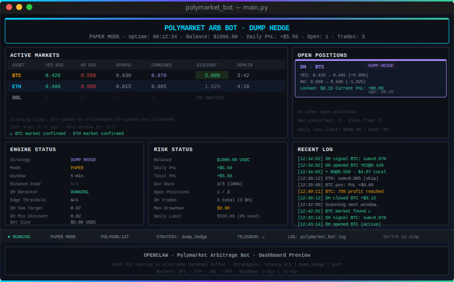

# OPENCLAW · POLYMARKET ARB BOT

> Two independent arbitrage strategies for Polymarket binary prediction markets on Polygon. try-now: https://genoshide-polymarket.replit.app/bot-dashboard/

[](https://python.org)
[](https://polygon.technology)
[](LICENSE)
[](https://docs.docker.com)

---

## Table of Contents

- [How It Works](#how-it-works)
  - [Latency Arb Strategy](#latency-arb-strategy)
  - [Dump Hedge Strategy](#dump-hedge-strategy)
- [Signal Validation Filters](#signal-validation-filters)
- [Prerequisites](#prerequisites)
- [Network & VPS Requirements](#network--vps-requirements)
- [Installation](#installation)
  - [Linux / Ubuntu](#linux--ubuntu)
  - [Windows](#windows)
  - [Docker (Any OS)](#docker-any-os)
- [Configuration](#configuration)
  - [Strategy Mode](#strategy-mode)
  - [Trading Markets](#trading-markets)
  - [Trade Window](#trade-window)
  - [Dump Hedge Parameters](#dump-hedge-parameters)
  - [Edge Detection](#edge-detection)
  - [Risk Management](#risk-management)
  - [Stop Loss / Take Profit](#stop-loss--take-profit)
  - [Telegram Notifications](#telegram-notifications)
  - [OpenClaw Integration](#openclaw-integration)
  - [Logging & Dashboard](#logging--dashboard)
- [Running the Bot](#running-the-bot)
- [Dashboard](#dashboard)
- [Kelly Criterion](#kelly-criterion)
- [Project Structure](#project-structure)
- [Troubleshooting](#troubleshooting)
- [Security](#security)
- [Disclaimer](#disclaimer)

---

## How It Works

The bot runs two independent arbitrage strategies, selectable via `STRATEGY` in `.env`.

### Latency Arb Strategy

Exploits a documented ~2.7-second pricing lag between Binance and Polymarket binary prediction markets.

```
  Binance WebSocket                Bot (<50ms)              Polymarket
  ─────────────────     ──────────────────────────     ────────────────────
  BTC: $83,000          Detects +$500 in 2.7s          "Bitcoin Up or Down"
  BTC: $83,500    ───►  Sigmoid model: P(UP)=0.65  ──► UP token still 0.50
                        Edge = 0.65 - 0.50 = 0.15      (oracle lag ~2.7s)
                        Buy UP @ 0.50 before update     ↓
                                                    Market corrects → 0.68
                                                    Exit at Take Profit ✓
```

**Requires:** Binance WebSocket feed. Best on a low-latency VPS near Singapore.

### Dump Hedge Strategy

Exploits temporary structural mispricings where the combined YES + NO ask price falls below $1.00.
Since exactly one of YES or NO must pay $1.00 at resolution, any combined price under $1.00 is a guaranteed locked profit — regardless of which direction the asset moves.

```
  Polymarket CLOB                  Bot                      At Resolution
  ─────────────────     ──────────────────────────     ────────────────────
  YES ask = 0.420       combined = 0.970               YES resolves $1.00
  NO  ask = 0.550  ───► discount = $0.030/share   ──►  NO  resolves $0.00
                        Buy BOTH legs                   Collect $1.00/share
                        Cost = $0.970/share             Profit = $0.030/share
                                                        = 3.09% locked ✓
```

**No Binance feed required.** Works any time the YES + NO combined ask is below `DH_SUM_TARGET`.
Also supports early exit: sell both legs when 70% of locked profit is realised (configurable).

### Fair Value Model

The bot estimates the true probability using a **time-aware sigmoid model**:

```
P(UP) = sigmoid( (price_now - price_to_beat) / scale(t) )

scale(t) = base_scale × sqrt(t / window) + min_scale
```

Where `price_to_beat` is the asset price at window open (the Chainlink resolution reference), and `scale(t)` shrinks as time runs out — the model becomes more certain as less time remains.

### Supported Assets

| Asset | Binance Feed | Min Price Move in 2.7s |
|-------|-------------|------------------------|
| BTC | `BTCUSDT@trade` | $5.00 |
| ETH | `ETHUSDT@trade` | $0.53 |
| SOL | `SOLUSDT@trade` | $0.05 |
| XRP | `XRPUSDT@trade` | $0.01 |

Each asset runs its own independent Binance WebSocket feed, market cache, and cooldown timer.

### Supported Windows

| Window | Markets | Notes |
|--------|---------|-------|
| `TRADE_WINDOW_MINUTES=5` | BTC/ETH/SOL/XRP Up or Down — 5 Minutes | Highest volume, tightest spreads |
| `TRADE_WINDOW_MINUTES=15` | BTC/ETH/SOL/XRP Up or Down — 15 Minutes | Lower noise, more history required |

---

## Signal Validation Filters

Every potential trade passes through four sequential filters before execution. All four must pass:

```
Binance price move detected
          │
          ▼
 ┌─────────────────────────────────────────────┐
 │ 1. MIN PRICE MOVE                           │
 │    abs(price_now - price_2.7s_ago)          │
 │    > min_price_move (per asset)             │
 └───────────────┬─────────────────────────────┘
                 │ pass
                 ▼
 ┌─────────────────────────────────────────────┐
 │ 2. ENTRY ZONE                               │
 │    0.38 ≤ current_token_price ≤ 0.62        │
 │                                             │
 │    Tokens outside this range reflect 10+   │
 │    minutes of accumulated market direction. │
 │    Our 2.7s lag cannot overcome that.       │
 └───────────────┬─────────────────────────────┘
                 │ pass
                 ▼
 ┌─────────────────────────────────────────────┐
 │ 3. FAIR VALUE STRENGTH                      │
 │    abs(fair_value - 0.50) ≥ 0.05            │
 │                                             │
 │    Model must output ≥55% conviction.       │
 │    If price_now ≈ PTB → sigmoid ≈ 0.50 →   │
 │    no real signal, skip even if token       │
 │    is cheap (fake edge).                    │
 └───────────────┬─────────────────────────────┘
                 │ pass
                 ▼
 ┌─────────────────────────────────────────────┐
 │ 4. MINIMUM EDGE                             │
 │    fair_value - token_price ≥ 0.05          │
 │                                             │
 │    Probability advantage must clear the     │
 │    threshold even after model conviction    │
 │    check.                                   │
 └───────────────┬─────────────────────────────┘
                 │ pass
                 ▼
 ┌─────────────────────────────────────────────┐
 │ 5. TIMING WINDOW                            │
 │    seconds_remaining ≥ min_seconds          │
 │    (auto: 20% of window = 60s / 180s)       │
 │                                             │
 │    Avoid entries in the final 20% of the   │
 │    window — high variance, model less       │
 │    reliable near resolution.                │
 └───────────────┬─────────────────────────────┘
                 │ pass
                 ▼
            TRADE FIRES
```

---

## Prerequisites

| Requirement | Details |
|-------------|---------|
| Python 3.9+ | Python 3.11 recommended |
| Polymarket account | With USDC on **Polygon mainnet** (not Ethereum mainnet) |
| Wallet private key | For signing orders — stored only in `.env` |
| Minimum balance | ~$5 USDC recommended |
| Stable internet | Low latency is critical — a VPS near exchange servers is strongly recommended |
| Docker (optional) | For containerised deployment |

> **Geographic restriction**: Polymarket is not available to US residents. Check the legal status in your jurisdiction before depositing funds.

---

## Network & VPS Requirements

Network quality directly affects signal accuracy and execution speed. This section is critical if you run from a home connection or are located in Southeast Asia, South Asia, or other regions with restricted access.

### Why Network Matters

The bot depends on two real-time WebSocket connections that are extremely latency-sensitive:

1. **Binance WebSocket** — streams live asset prices. A 100ms delay here means the bot sees price moves 100ms late, reducing the usable lag window.
2. **Polymarket WebSocket** — streams live order book prices. If this connection fails, the bot falls back to REST API (~200–500ms), which can cause stale price errors in edge calculation.

### Geo-Restrictions

| Service | Restriction | Symptom |
|---------|-------------|---------|
| Polymarket CLOB WebSocket | Blocked in some regions (HTTP 403/451) | Log: `PM WS: Connection rejected` — falls back to REST |
| Polymarket REST API | Generally accessible | May be slow from distant regions |
| Binance WebSocket | Blocked for US IPs | `ConnectionResetError` on startup |

**If you see this in logs:**
```
PM WS: Connection rejected (HTTP 403/451) — falling back to REST-only mode
```
This means the Polymarket WebSocket is blocked for your IP/region. The bot continues to function using REST-only mode, but price updates are slower (~200–500ms instead of ~20ms). This increases the risk of stale price entries.

### VPS Recommendation

Running the bot on a VPS near the exchange servers eliminates geo-block issues and reduces latency by 80–95%.

**Recommended providers and locations:**

| Provider | Recommended Location | Latency to Binance | Cost |
|----------|---------------------|--------------------|------|
| DigitalOcean | Singapore (`sgp1`) | ~5–15ms | $6/mo (1GB RAM) |
| Vultr | Singapore | ~5–15ms | $6/mo |
| Hetzner | Singapore | ~10–20ms | $5/mo |
| AWS | ap-southeast-1 (Singapore) | ~5–10ms | ~$8/mo (t3.micro) |
| Contabo | Singapore | ~10–20ms | $5/mo |

> Singapore is optimal for Binance (Singapore exchange node) and has no Polymarket geo-block issues.

### VPS Setup (Ubuntu 22.04)

```bash
# 1. SSH into your VPS
ssh root@YOUR_VPS_IP

# 2. Install Python 3.11
sudo apt update && sudo apt install -y python3.11 python3.11-venv git

# 3. Clone the bot
git clone https://github.com/genoshide/polymarket-arbitrage-trading-bot.git
cd polymarket-arbitrage-trading-bot

# 4. Create venv and install
python3.11 -m venv venv
source venv/bin/activate
pip install -r requirements.txt

# 5. Configure
cp .env.example .env
nano .env    # fill in credentials

# 6. Run with screen (keeps running after SSH disconnect)
screen -S bot
python main.py --live

# Detach: Ctrl+A then D
# Reattach: screen -r bot
```

### Minimum VPS Specs

| Resource | Minimum | Recommended |
|----------|---------|-------------|
| CPU | 1 vCPU | 2 vCPU |
| RAM | 512 MB | 1 GB |
| Bandwidth | 1 TB/mo | 2 TB/mo |
| OS | Ubuntu 20.04+ | Ubuntu 22.04 LTS |

> The bot is lightweight (~50–100 MB RAM for 4 assets). The cheapest VPS tier at any provider is sufficient.

### Windows Connection Issues

On Windows, the `WinError 64 — The specified network name is no longer available` error in Binance WebSocket logs is a **normal transient Windows network event**. The reconnect logic handles it automatically. All feeds reconnect within a few seconds.

If it happens repeatedly at startup, check:
- Windows Defender Firewall is not blocking Python
- Antivirus is not intercepting WebSocket traffic
- Use Windows Terminal (not CMD) for the dashboard

---

## Installation

Choose the method that matches your operating system.

---

### Linux / Ubuntu

#### Option A — One-command installer (recommended)

```bash
git clone https://github.com/genoshide/polymarket-arbitrage-trading-bot.git
cd polymarket-arbitrage-trading-bot
chmod +x scripts/install.sh
./scripts/install.sh
```

The script will:
1. Detect Python 3.9+ automatically
2. Create `./venv` virtual environment
3. Install all dependencies
4. Copy `.env.example` → `.env`
5. Run the health check

Then edit your config and start:

```bash
nano .env                    # fill in your credentials
./scripts/start.sh paper     # paper (simulation) mode
./scripts/start.sh live      # live mode (real funds)
```

#### Option B — Manual steps

```bash
# 1. Install Python (if not already installed)
sudo apt update
sudo apt install python3.11 python3.11-venv python3-pip -y

# 2. Clone the repository
git clone https://github.com/genoshide/polymarket-arbitrage-trading-bot.git
cd polymarket-arbitrage-trading-bot

# 3. Create virtual environment
python3.11 -m venv venv
source venv/bin/activate

# 4. Install dependencies
pip install --upgrade pip
pip install -r requirements.txt

# 5. Configure
cp .env.example .env
nano .env    # fill in your credentials

# 6. Health check (optional but recommended)
python healthcheck.py

# 7. Run
python main.py --paper    # paper mode
python main.py --live     # live mode
```

#### Option C — Makefile (requires `make`)

```bash
make install    # create venv + install deps
make setup      # copy .env.example → .env
make health     # run health check
make paper      # start paper mode
make live       # start live mode
```

#### Running as a background service (systemd)

To keep the bot running after you log out:

```bash
sudo nano /etc/systemd/system/polymarket-arbitrage-trading-bot.service
```

Paste this content (replace `/home/youruser/polymarket-arbitrage-trading-bot` with your actual path):

```ini
[Unit]
Description=Polymarket Arbitrage Bot
After=network-online.target
Wants=network-online.target

[Service]
Type=simple
User=youruser
WorkingDirectory=/home/youruser/polymarket-arbitrage-trading-bot
ExecStart=/home/youruser/polymarket-arbitrage-trading-bot/venv/bin/python main.py --live
Restart=on-failure
RestartSec=10
StandardOutput=journal
StandardError=journal

[Install]
WantedBy=multi-user.target
```

```bash
sudo systemctl daemon-reload
sudo systemctl enable polymarket-arbitrage-trading-bot
sudo systemctl start polymarket-arbitrage-trading-bot
sudo systemctl status polymarket-arbitrage-trading-bot    # verify it's running
journalctl -u polymarket-arbitrage-trading-bot -f         # tail logs
```

---

### Windows

#### Option A — One-command installer (recommended)

Open **Command Prompt** or **PowerShell** as a normal user (not Administrator):

```cmd
git clone https://github.com/genoshide/polymarket-arbitrage-trading-bot.git
cd polymarket-arbitrage-trading-bot
scripts\install.bat
```

Then:

```cmd
notepad .env               :: fill in your credentials
scripts\start.bat paper    :: paper mode
scripts\start.bat live     :: live mode
```

#### Option B — Git Bash (Unix-style terminal on Windows)

If you have [Git for Windows](https://gitforwindows.org/) installed, you can use the Unix scripts:

```bash
git clone https://github.com/genoshide/polymarket-arbitrage-trading-bot.git
cd polymarket-arbitrage-trading-bot
./scripts/install.sh      # works in Git Bash
./scripts/start.sh paper
```

#### Option C — Manual steps (CMD)

```cmd
:: 1. Install Python from https://python.org (check "Add to PATH")

:: 2. Clone
git clone https://github.com/genoshide/polymarket-arbitrage-trading-bot.git
cd polymarket-arbitrage-trading-bot

:: 3. Create virtual environment
python -m venv venv
venv\Scripts\activate

:: 4. Install dependencies
pip install --upgrade pip
pip install -r requirements.txt

:: 5. Configure
copy .env.example .env
notepad .env

:: 6. Run
python main.py --paper
```

> **Windows note**: The Rich dashboard requires [Windows Terminal](https://aka.ms/terminal) for correct colour rendering. The default `cmd.exe` may show garbled output — use Windows Terminal or Git Bash.

---

### Docker (Any OS)

Docker works identically on Linux, macOS, and Windows. Requires [Docker Desktop](https://www.docker.com/products/docker-desktop/) or Docker Engine.

#### Quick start

```bash
# 1. Configure
cp .env.example .env
nano .env     # (or notepad .env on Windows)

# 2. Build image
docker build -t polymarket-arbitrage-trading-bot .

# 3. Run paper mode (interactive, with dashboard)
docker compose run --rm -it bot --paper

# 4. Run as background daemon
docker compose up -d
```

#### All Docker commands

| Command | What it does |
|---------|-------------|
| `make docker-build` | Build the image |
| `make docker-paper` | Paper mode, interactive (dashboard visible) |
| `make docker-live` | Live mode, interactive (5-second abort window) |
| `make docker-up` | Start as background daemon |
| `make docker-stop` | Stop the container |
| `make docker-logs` | Tail live log output |
| `make docker-health` | Run healthcheck inside container |
| `make docker-shell` | Open bash shell inside container |
| `make docker-clean` | Remove image, volumes, containers |

#### Docker notes

- Credentials are loaded from `.env` at runtime — never baked into the image
- Logs are persisted to `./logs/polymarket_bot.log` via a bind mount
- The dashboard is only visible in interactive mode (`-it`). In daemon mode the bot logs to file only
- `docker stop` triggers a clean shutdown — the bot has 15 seconds to close open positions

---

## Configuration

All settings live in `.env`. Run `cp .env.example .env` (Linux/macOS) or `copy .env.example .env` (Windows) to create it.

### Strategy Mode

```env
STRATEGY=dump_hedge
```

| Value | Description | Requires |
|-------|-------------|----------|
| `latency_arb` | Binance lag exploitation | Binance WebSocket, low-latency VPS |
| `dump_hedge` | Structural YES+NO arbitrage | Polymarket REST only (no Binance needed) |
| `both` | Both strategies run simultaneously | Both of the above |

**Recommended starting point:** `STRATEGY=dump_hedge` — simpler setup, no Binance dependency, guaranteed locked profit on every entry.

---

### Polymarket Credentials

```env
POLYMARKET_PRIVATE_KEY=0xYOUR_PRIVATE_KEY_HERE
POLYMARKET_FUNDER=0xYOUR_WALLET_ADDRESS_HERE
POLYMARKET_SIGNATURE_TYPE=1
```

| Variable | Description | Required |
|----------|-------------|----------|
| `POLYMARKET_PRIVATE_KEY` | Wallet private key for signing orders | **Live only** |
| `POLYMARKET_FUNDER` | Wallet address holding your USDC on Polygon | **Live only** |
| `POLYMARKET_SIGNATURE_TYPE` | `1` = EIP-712 proxy (Gnosis Safe) · `0` = EOA direct | Yes |

> **How to find your wallet address**: Open MetaMask → copy the address shown at the top. This is your `POLYMARKET_FUNDER`.

---

### Trading Markets

```env
MARKETS=btc,eth,sol
```

| Value | Active Markets | Recommended For |
|-------|---------------|-----------------|
| `MARKETS=btc` | BTC only | Small balance, unstable connection |
| `MARKETS=btc,eth` | BTC + ETH | Moderate balance |
| `MARKETS=btc,eth,sol` | BTC + ETH + SOL | Default — good signal frequency |
| `MARKETS=btc,eth,sol,xrp` | All four | Maximum opportunity |

> More markets = more WebSocket connections + more API calls. Start with `btc` only if your balance is small or your latency is high.

---

### Trade Window

```env
TRADE_WINDOW_MINUTES=5
```

| Value | Market Series | Window | Best For |
|-------|--------------|--------|----------|
| `5` | Up or Down — 5 Minutes | 300s | Highest volume, tightest spreads, best latency arb |
| `15` | Up or Down — 15 Minutes | 900s | Less competition, lower noise |

**Important for 15-minute windows:**
- The Binance price history buffer covers 18 minutes (~1080s) to support the full window
- `POSITION_TIMEOUT_SECONDS` is auto-derived as 900s (no need to set manually)
- `EDGE_MIN_SECONDS_REMAINING` is auto-derived as 180s (no entry in last 3 minutes)
- Use the same `ASSET_CONFIG` scale values — the model normalises for window duration

---

### Trading Mode

```env
PAPER_MODE=true
PAPER_STARTING_BALANCE=1000.0
```

| Setting | Description |
|---------|-------------|
| `PAPER_MODE=true` | **Simulation only** — no real orders placed. Safe to run indefinitely. |
| `PAPER_MODE=false` | **Live trading** — real USDC spent. Only use after validating in paper mode. |
| `PAPER_STARTING_BALANCE` | Virtual starting balance for paper mode. Does not affect live mode. |

**Always run paper mode for at least 20+ trades** before going live. Target metrics before switching:

| Metric | Minimum |
|--------|---------|
| Total trades | ≥ 200 |
| Win rate | ≥ 55% |
| Total PnL | Positive |
| Max drawdown | < 20% |

---

### Dump Hedge Parameters

```env
DH_SUM_TARGET=0.97
DH_MIN_DISCOUNT=0.02
DH_FIXED_BET_USDC=5
DH_EARLY_EXIT_PROFIT_FRACTION=0.70
DH_COOLDOWN_SECONDS=30.0
# DH_TIMEOUT_SECONDS=270
```

| Variable | Default | Description |
|----------|---------|-------------|
| `DH_SUM_TARGET` | `0.97` | Max combined YES+NO ask to enter. `0.97` = enter when combined ≤ 97¢. |
| `DH_MIN_DISCOUNT` | `0.02` | Minimum locked discount per share. Guards against fees eating the profit. |
| `DH_FIXED_BET_USDC` | `5` | Total USDC per DH trade (split ~50/50 across YES and NO legs). |
| `DH_EARLY_EXIT_PROFIT_FRACTION` | `0.70` | Exit early when this fraction of locked profit is realised (0.70 = 70%). |
| `DH_TIMEOUT_SECONDS` | **auto** | Force-close after this many seconds. Auto: 90% of window (270s for 5-min). |
| `DH_COOLDOWN_SECONDS` | `30.0` | Cooldown between DH signals on the same asset. |

**Minimum bet size note:**

Polymarket enforces a **$1.00 minimum per order leg**. With `DH_FIXED_BET_USDC=5` and a typical combined price of 0.97, each leg costs ~$2.40 — safely above the minimum. Do not set `DH_FIXED_BET_USDC` below `2` or individual leg costs may fall under $1.00 and orders will be rejected.

**Position sizing formula:**

```
shares  = DH_FIXED_BET_USDC / combined_price
yes_cost = shares × yes_price   (must be ≥ $1.00)
no_cost  = shares × no_price    (must be ≥ $1.00)
```

**Exit conditions (checked every 0.5s):**

1. `realised_pnl ≥ locked_profit × DH_EARLY_EXIT_PROFIT_FRACTION` → early exit
2. `age ≥ DH_TIMEOUT_SECONDS` → timeout close
3. Market resolved (404 from CLOB after 30s) → close at locked profit
4. `pnl% ≤ STOP_LOSS_PNL` → stop loss cut

---

### Edge Detection

```env
EDGE_LAG_WINDOW_SECONDS=2.7
EDGE_MIN_EDGE_THRESHOLD=0.05
EDGE_COOLDOWN_SECONDS=15
EDGE_MIN_MARKET_LIQUIDITY=500
EDGE_MIN_ENTRY_PRICE=0.38
EDGE_MAX_ENTRY_PRICE=0.62
EDGE_MIN_FAIR_VALUE_STRENGTH=0.05
# EDGE_MIN_SECONDS_REMAINING=180
```

| Variable | Default | Description |
|----------|---------|-------------|
| `EDGE_LAG_WINDOW_SECONDS` | `2.7` | Measured Polymarket lag. Do not go below `2.0`. |
| `EDGE_MIN_EDGE_THRESHOLD` | `0.05` | Minimum probability edge to trade. Higher = fewer but stronger signals. |
| `EDGE_COOLDOWN_SECONDS` | `15` | Per-asset cooldown after a trade. Prevents re-entering too quickly. |
| `EDGE_MIN_MARKET_LIQUIDITY` | `500` | Minimum market USDC liquidity. Markets below this are skipped. |
| `EDGE_MIN_ENTRY_PRICE` | `0.38` | Lower bound of the entry zone. Tokens below this are already heavily priced directional. |
| `EDGE_MAX_ENTRY_PRICE` | `0.62` | Upper bound of the entry zone. Symmetric with the above. |
| `EDGE_MIN_FAIR_VALUE_STRENGTH` | `0.05` | Model conviction required. `abs(fair_value − 0.5) ≥ this`. Blocks weak/noise signals. |
| `EDGE_MIN_SECONDS_REMAINING` | auto | Minimum window time before entry. Auto: 20% of window (60s for 5-min, 180s for 15-min). |

**Why the entry zone filter matters:**

A token priced at 15¢ means the market has spent 10+ minutes of accumulated trading concluding that this direction has only a 15% chance of winning. Our 2.7-second lag advantage cannot overcome that evidence. The entry zone `[0.38, 0.62]` restricts trading to the near-50/50 zone where latency arb has maximum impact.

**Why the fair value strength filter matters:**

If the current asset price is very close to `price_to_beat` (window open price), the sigmoid model outputs ≈ 0.50 — it genuinely has no signal. Without this filter, a cheap token (e.g. 15¢) creates an apparent edge of `0.50 − 0.15 = 35%` which is completely fake. This filter requires the model to have ≥55% conviction before the edge comparison even runs.

**Choosing `EDGE_MIN_EDGE_THRESHOLD`:**

| Value | Behaviour |
|-------|-----------|
| `0.04` | Aggressive — trades almost every movement |
| `0.05` | Balanced — only meaningful edges (recommended) |
| `0.08` | Conservative — fewer trades, higher quality |

---

### Risk Management

```env
RISK_MAX_POSITION_FRACTION=0.35
KELLY_ENABLED=false
RISK_FIXED_BET_USDC=2.0
RISK_KELLY_FRACTION=0.5
RISK_MAX_CONCURRENT_POSITIONS=3
RISK_DAILY_LOSS_LIMIT=0.20
RISK_TOTAL_DRAWDOWN_KILL=0.40
```

| Variable | Default | Description |
|----------|---------|-------------|
| `RISK_MAX_POSITION_FRACTION` | `0.35` | Max single position as fraction of balance. Keep ≤ 0.50. |
| `KELLY_ENABLED` | `false` | `true` = Kelly formula sizing · `false` = fixed bet |
| `RISK_FIXED_BET_USDC` | `2.0` | Fixed USDC per trade (when `KELLY_ENABLED=false`) |
| `RISK_KELLY_FRACTION` | `0.5` | Half-Kelly multiplier. 0.5 recommended (safer than full Kelly) |
| `RISK_MAX_CONCURRENT_POSITIONS` | `3` | Max simultaneous open positions |
| `RISK_DAILY_LOSS_LIMIT` | `0.20` | Bot pauses if daily loss exceeds 20% |
| `RISK_TOTAL_DRAWDOWN_KILL` | `0.40` | Permanent halt if drawdown from peak exceeds 40% |

**Minimum balance note:**

```
balance × RISK_MAX_POSITION_FRACTION ≥ RISK_FIXED_BET_USDC

Example: $3.00 × 0.35 = $1.05 — can fit a $1 fixed bet
Example: $2.00 × 0.35 = $0.70 — cannot fit a $1 bet → raise fraction to 0.50
```

**Protection layers:**

```
Layer 1 — Max position fraction  →  no single bet exceeds X% of balance
Layer 2 — Max concurrent         →  max N open positions at once
Layer 3 — Daily loss limit       →  pauses trading, resets at midnight UTC
Layer 4 — Kill switch            →  permanent halt, manual reset required
```

---

### Stop Loss / Take Profit

```env
TAKE_PROFIT_PRICE=0.72
TAKE_PROFIT_PNL=0.12
STOP_LOSS_PNL=-0.20
NEAR_WIN_PRICE=0.92
NEAR_LOSS_PRICE=0.08
# POSITION_TIMEOUT_SECONDS=300
```

| Variable | Default | Description |
|----------|---------|-------------|
| `TAKE_PROFIT_PRICE` | `0.72` | Exit when YES token price reaches 72 cents |
| `TAKE_PROFIT_PNL` | `0.12` | Exit when unrealised PnL reaches +12% |
| `STOP_LOSS_PNL` | `-0.20` | Exit when unrealised PnL falls below −20%. Set `0.0` to disable. |
| `NEAR_WIN_PRICE` | `0.92` | Exit early at 92 cents — market about to resolve YES |
| `NEAR_LOSS_PRICE` | `0.08` | Exit early at 8 cents — market about to resolve NO |
| `POSITION_TIMEOUT_SECONDS` | **auto** | Force-close any position older than this. **Auto-derived**: 300s for 5-min, 900s for 15-min window. Uncomment to override. |

> **TAKE_PROFIT_PRICE must be above your typical entry price.** With the entry zone filter `[0.38, 0.62]`, entries happen between 38–62¢. Setting `TAKE_PROFIT_PRICE=0.42` would never trigger for entries above 42¢. The default `0.72` gives room for the market to move.

Exit conditions are checked in this order:
1. `current_price ≥ NEAR_WIN_PRICE` → near-win exit
2. `current_price ≤ NEAR_LOSS_PRICE` → near-loss cut
3. `current_price ≥ TAKE_PROFIT_PRICE` **or** `pnl% ≥ TAKE_PROFIT_PNL` → take profit
4. `pnl% ≤ STOP_LOSS_PNL` → stop loss
5. `age ≥ POSITION_TIMEOUT_SECONDS` → timeout close

---

### Telegram Notifications

```env
TELEGRAM_BOT_TOKEN=YOUR_BOT_TOKEN
TELEGRAM_CHAT_ID=YOUR_NUMERIC_CHAT_ID
TELEGRAM_ENABLED=true
```

**Setup (5 minutes):**
1. Open Telegram → search `@BotFather` → send `/newbot`
2. Follow prompts → copy the token → paste into `TELEGRAM_BOT_TOKEN`
3. Open `@userinfobot` → it replies with your numeric ID → paste into `TELEGRAM_CHAT_ID`

**Notifications sent:**

| Event | Content |
|-------|---------|
| Bot started | Mode, strategy, balance, active markets |
| Trade opened (latency arb) | Asset, direction (UP/DOWN), entry price, edge %, move size, order ID |
| Trade closed (latency arb) | PnL (USDC + %), entry → exit price, duration, exit reason |
| DH opened | Asset, YES price, NO price, combined, locked profit, bet size |
| DH closed | Asset, PnL, exit reason (early exit / timeout / resolved) |
| DH resolved | Auto-close when market resolves (404 detected after 30s grace) |
| Kill switch triggered | Reason, session summary (balance, PnL, win rate, trade count) |
| Daily halt | Reason, current balance |

**Example notifications:**

```
📄 Trade Opened  BTC ▲ UP
━━━━━━━━━━━━━━━━━━━━
Price: 0.4800  Edge: 8.21%  Move: +$312.50
Size: $5.00 USDC

📄 Trade Closed  BTC ▲ UP
━━━━━━━━━━━━━━━━━━━━
PnL: +$0.72 USDC (+14.4%)
Entry → Exit: 0.48 → 0.68  Duration: 1:47
Reason: Take profit (price)

🔀 DH Opened | BTC
YES@0.420 + NO@0.550 | combined=0.970
Locked: $0.15 | Bet: $4.87

🔀 DH Closed | BTC | PnL: +$0.15
Reason: Early exit (70% locked profit reached)
```

---

### OpenClaw Integration

```env
OPENCLAW_ENABLED=false
OPENCLAW_API_KEY=YOUR_OPENCLAW_API_KEY_HERE
OPENCLAW_API_URL=https://app.openclaw.ai/api
OPENCLAW_AGENT_ID=main
OPENCLAW_REPORT_INTERVAL=300
```

Set `OPENCLAW_ENABLED=true` to enable AI agent integration. When disabled, all OpenClaw API calls are completely skipped.

**Remote commands supported:**

| Command | Description |
|---------|-------------|
| `pause` | Pause trading |
| `resume` | Resume from pause |
| `status` | Push performance summary to Telegram |
| `reset_kill_switch` | Reset kill switch (requires `confirm: true`) |
| `stop` | Graceful shutdown |

---

### Logging & Dashboard

```env
LOG_LEVEL=INFO
LOG_FILE=polymarket_bot.log
DASHBOARD_LOG_LINES=20
```

| Variable | Default | Description |
|----------|---------|-------------|
| `LOG_LEVEL` | `INFO` | Log verbosity: `DEBUG` / `INFO` / `WARNING` / `ERROR` / `CRITICAL` |
| `LOG_FILE` | `polymarket_bot.log` | Log file path. Rotates at 10 MB, keeps 5 backups. |
| `DASHBOARD_LOG_LINES` | `20` | Number of recent log lines shown in the dashboard panel. |

> Use `LOG_LEVEL=DEBUG` temporarily to see every signal evaluation, filter rejection, and WebSocket event. Set back to `INFO` for normal operation.

---

## Running the Bot

### Command-line flags

```bash
# Paper mode (simulation — no real funds)
python main.py --paper

# Live mode (real funds — use with caution)
python main.py --live

# Use PAPER_MODE setting from .env (default)
python main.py

# Override log verbosity
python main.py --paper --log-level DEBUG

# Override starting balance (paper mode only)
python main.py --paper --balance 500
```

### Using scripts

**Linux / macOS / Git Bash:**
```bash
./scripts/start.sh paper    # paper mode
./scripts/start.sh live     # live mode (5s abort window)
./scripts/start.sh health   # health check only
```

**Windows CMD:**
```cmd
scripts\start.bat paper
scripts\start.bat live
scripts\start.bat health
```

### Using make

```bash
make paper       # paper mode
make live        # live mode
make run         # from .env setting
make health      # run health check
```

---

## Dashboard

The bot displays a live terminal dashboard using the Rich alternate screen (similar to `htop` — the whole screen is taken over, no scrolling noise).



```
┌─── POLYMARKET ARB BOT  ·  DUMP HEDGE ─────────────────────────────────────────┐
│  2026-04-06 12:34:11 UTC  ◆ PAPER  ● ACTIVE  Uptime 00:12:34                  │
│  Balance $1000.00  Daily +$5.50  Total +$5.50  Open 1  Trades 3  (100% win)   │
└────────────────────────────────────────────────────────────────────────────────┘

┌─── ACTIVE MARKETS — 5 MIN ──────────────────────────────────┐ ┌─ OPEN POSITIONS ─┐
│  ASSET  YES BID  NO BID  SPREAD  COMBINED  DISCOUNT  REMAIN  │ │ DH · BTC          │
│  BTC    0.4200   0.5500  0.0300  0.9700     3.09%    3:42    │ │ [DUMP-HEDGE]      │
│  ETH    0.4800   0.5050  0.0150  0.9850     1.52%    4:10    │ │ YES entry: 0.4200 │
│  SOL    —        —       —       —         no market  —      │ │ NO  entry: 0.5500 │
└─────────────────────────────────────────────────────────────┘ │ Locked: $0.0150   │
                                                                  └───────────────────┘
┌─── ENGINE STATUS ───────┐ ┌─── RISK STATUS ──────────┐ ┌─── RECENT LOG ──────────┐
│  Strategy  DUMP HEDGE   │ │  Balance  $1000.00 USDC  │ │  12:34:02 INFO signal   │
│  Mode      PAPER        │ │  Daily    +$5.50          │ │  12:34:03 INFO opened   │
│  Window    5-min        │ │  Win Rate 3/3 (100%)      │ │  12:38:12 INFO skip     │
│  Binance   N/A          │ │  Open Pos 1 / 3           │ │  12:40:12 INFO closed   │
│  DH Det.   ● RUNNING    │ │  DH Trades 3 total        │ │  ...                    │
│  Sum Tgt   0.97         │ │  Drawdown $0.00 (0.0%)    │ │                         │
│  Min Disc  0.02         │ │  Daily Lim $200 (0% used) │ │                         │
└─────────────────────────┘ └──────────────────────────┘ └─────────────────────────┘
● RUNNING │ PAPER MODE │ POLYGON:137 │ STRATEGY: dump_hedge │ TELEGRAM: ✓ │ Ctrl+C
```

**Dashboard panels:**
- **Header** — UTC time, mode (PAPER/LIVE), status, uptime, balance, daily/total PnL, open count, win rate
- **Binance feed cards** — live price, 2.7s and 60s move, tick count, WS status *(latency_arb / both only)*
- **Active Markets** — YES/NO bid prices, combined sum, discount %, and time remaining per asset
- **Open Positions** — card per position: DH (purple border) shows locked profit; LA (yellow) shows entry and age
- **Engine Status** — strategy, mode, window, Binance/DH/edge detector status, DH thresholds and bet size
- **Risk Status** — balance, daily/total PnL, win rate, open position count, drawdown, daily loss limit usage
- **Recent Log** — last N lines (configurable via `DASHBOARD_LOG_LINES`) with timestamps and log levels
- **Status bar** — one-line summary: running state, strategy, chain, Telegram status, log file

**Ctrl+C behaviour:** if there are open positions when you press Ctrl+C, the dashboard pauses and asks for confirmation before exiting. Press `E` + Enter to exit (positions left unresolved), or `C` + Enter to keep running. A second Ctrl+C forces an immediate exit.

> **Windows Terminal required on Windows** for proper colour and Unicode rendering. The old `cmd.exe` will display garbled output.

---

## Kelly Criterion

```
f* = (p × b - q) / b

Where:
  p  = estimated win probability (from edge detector)
  q  = 1 - p
  b  = net odds = (1 - price) / price
```

**Example**: BTC +$300 in 2.7s → model estimates P(UP) = 0.65, UP token at 0.52:

```
b  = (1 - 0.52) / 0.52 = 0.923
f* = (0.65 × 0.923 - 0.35) / 0.923 = 27.1%

Half-Kelly (×0.5)   = 13.55%
Cap at 35% fraction → 13.55% of balance → $13.55 on $100 balance
```

**Fixed bet vs Kelly:**

| Mode | Config | When to use |
|------|--------|-------------|
| Fixed bet | `KELLY_ENABLED=false` + `RISK_FIXED_BET_USDC=2.0` | Small balance (<$20) — simple and consistent |
| Kelly | `KELLY_ENABLED=true` + `RISK_KELLY_FRACTION=0.5` | Larger balance (>$50) — maximises geometric growth |

---

## Project Structure

```
polymarket_bot/
│
├── main.py                  # Main orchestrator + trading loop (20 Hz)
├── config.py                # Environment variable loader & validator
├── healthcheck.py           # Pre-flight system checker
├── requirements.txt         # Python dependencies
├── pyproject.toml           # Project metadata + ruff/mypy/pytest config
├── Makefile                 # Developer convenience commands
├── Dockerfile               # Multi-stage production container
├── docker-compose.yml       # Container orchestration
├── .env.example             # Config template — copy to .env
├── .env                     # Your credentials (NEVER commit this)
│
├── core/
│   ├── binance_ws.py           # Binance WebSocket feed — real-time prices + history buffer
│   ├── polymarket_client.py    # Polymarket CLOB API — orders, markets, prices
│   ├── edge_detector.py        # Latency arb signal engine — sigmoid model + filter chain
│   ├── dump_hedge_detector.py  # Dump hedge signal engine — combined price scanner
│   └── polymarket_ws.py        # Polymarket real-time order book WebSocket (optional)
│
├── risk/
│   ├── kelly.py             # Kelly Criterion + fixed bet position sizer
│   └── risk_manager.py      # Drawdown tracking, daily halt, kill switch
│
├── integration/
│   ├── telegram.py          # Telegram alert notifications (async thread pool)
│   └── openclaw.py          # OpenClaw AI agent integration (async thread pool)
│
├── utils/
│   ├── dashboard.py         # Rich Live terminal dashboard
│   ├── logger.py            # Coloured console + rotating file logger
│   └── retry.py             # Async/sync retry decorator (exponential backoff)
│
├── scripts/
│   ├── install.sh           # Unix one-command installer
│   ├── install.bat          # Windows one-command installer
│   ├── start.sh             # Unix launcher (paper/live/health)
│   └── start.bat            # Windows launcher
│
└── tests/
    └── test_bot.py          # Unit tests (Kelly, Risk, Config, Edge, Retry)
```

See [ARCHITECTURE.md](ARCHITECTURE.md) for a detailed technical breakdown of each component and data flow.

---

## Troubleshooting

### Bot exits immediately / no output

```bash
# Run health check first
python healthcheck.py
```

Common causes:
- `.env` file missing → `cp .env.example .env`
- `POLYMARKET_PRIVATE_KEY` not set and `PAPER_MODE=false`
- Missing packages → `pip install -r requirements.txt`
- `TRADE_WINDOW_MINUTES` is not `5` or `15` → only these values are valid

### Bot detects no signals

| Cause | Fix |
|-------|-----|
| Market below liquidity threshold | Lower `EDGE_MIN_MARKET_LIQUIDITY` to `300` |
| Entry zone too narrow | Widen `EDGE_MIN_ENTRY_PRICE` / `EDGE_MAX_ENTRY_PRICE` |
| Fair value strength too high | Lower `EDGE_MIN_FAIR_VALUE_STRENGTH` to `0.03` |
| Threshold too high | Lower `EDGE_MIN_EDGE_THRESHOLD` to `0.04` |
| Cooldown active | Check log — `EDGE_COOLDOWN_SECONDS` may be long |
| Price not moving | Normal during low-volatility periods |
| Market time expired | Bot blocked last 20% of window by `EDGE_MIN_SECONDS_REMAINING` |

### `Kelly returned None` / no trades opening

Most common cause: balance too small for position fraction.

```
Balance $3.00 × fraction 0.30 = $0.90 < $1.00 minimum → blocked
Balance $3.00 × fraction 0.40 = $1.20 ≥ $1.00         → OK ✓
```

Fix: raise `RISK_MAX_POSITION_FRACTION` or deposit more USDC.

### Fake high-edge signals (entries at 1–15¢)

All three protective filters should catch this, but if you see entries far below 38¢:
- Verify `EDGE_MIN_ENTRY_PRICE=0.38` is set in `.env`
- Verify `EDGE_MIN_FAIR_VALUE_STRENGTH=0.05` is set in `.env`
- Check `LOG_LEVEL=DEBUG` to see which filter is passing/failing

### Polymarket WebSocket not connecting

```
PM WS: Connection rejected (HTTP 403/451) — falling back to REST-only mode
```

This is a geo-restriction on the Polymarket WebSocket endpoint. **The bot continues to function in REST-only mode** — prices update every ~200–500ms instead of ~20ms.

To resolve permanently: **run the bot on a VPS in Singapore** (see [Network & VPS Requirements](#network--vps-requirements)).

### Binance WebSocket disconnecting (`WinError 64`)

```
WebSocket disconnected (ConnectionResetError: [WinError 64] ...)
```

This is a Windows network transient — the reconnect logic handles it automatically. All feeds reconnect within seconds. If it happens repeatedly:
- Check Windows Defender Firewall is not blocking Python
- Check your antivirus is not intercepting the connection
- Consider running on a Linux VPS for stability

### Paper mode shows different results than live mode

Paper mode simulates fills at the best ask price from the CLOB. In live mode, slippage, partial fills, and order book depth affect actual fill prices. Paper PnL may be slightly optimistic.

### Dashboard not rendering (Windows)

Use [Windows Terminal](https://aka.ms/terminal). The classic `cmd.exe` does not support alternate screen buffer.

### ETH / SOL / XRP never get signals

Normal during low-volatility periods. The per-asset minimum price move must be exceeded within the 2.7-second lag window:

| Asset | Required move in 2.7s |
|-------|----------------------|
| BTC | $5.00 |
| ETH | $0.53 |
| SOL | $0.05 |
| XRP | $0.01 |

---

## Security

| Rule | Details |
|------|---------|
| ✅ Private key in `.env` only | Never hardcode keys in source files |
| ✅ `.env` in `.gitignore` | Will never be committed to version control |
| ✅ `.env` not baked into Docker image | Injected at runtime via `env_file` |
| ✅ Dedicated trading wallet | Use a wallet created specifically for this bot |
| ✅ Minimum USDC only | Only deposit the amount you intend to trade with |
| ❌ Never commit `.env` | Not to GitHub, Gist, Pastebin, or Discord |
| ❌ Never share your private key | With anyone, ever |
| ❌ Never run on a shared computer | Your `.env` could be read by other users |

**Recommended setup:**
1. Create a fresh MetaMask wallet specifically for this bot
2. Transfer only the USDC you want to trade (e.g. $20–$50 to start)
3. Keep your main wallet completely separate
4. Run in paper mode for 1+ week before funding the trading wallet

---

## Disclaimer

This software is provided for educational and experimental purposes only. Prediction market trading involves significant financial risk. Past performance does not guarantee future results. The arbitrage window narrows as more bots compete. You are solely responsible for any financial losses. Always validate in paper mode before deploying real capital.
